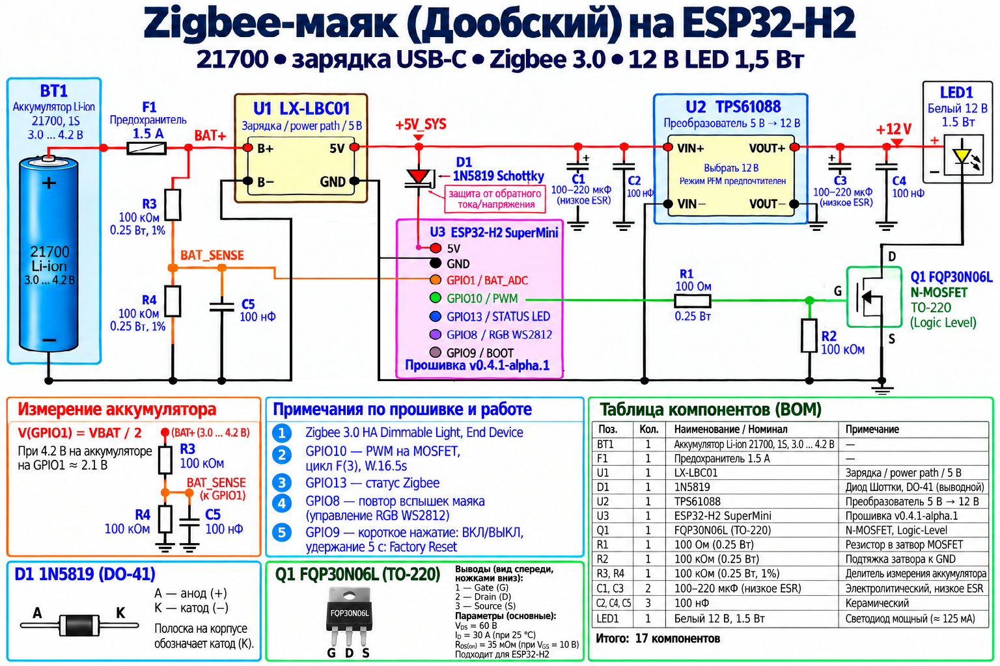

# Doobsky Zigbee Beacon — ESP32-H2 SuperMini

[](https://github.com/Roman23rus/doobsky-zigbee-beacon-h2/actions/workflows/firmware-ci.yml)


Прошивка для автономной 12-вольтовой LED-модели маяка Doobsky с характеристикой огня **Fl(3).W.16.5s**, управлением по **Zigbee 3.0**, контролем аккумулятора и плавной оптической огибающей вспышек.

> Проект находится в статусе **Alpha**: основная архитектура, Zigbee, PWM, сохранение состояния и аппаратная индикация уже проверены на реальном ESP32-H2, но точные длительности отдельных элементов характеристики Doobsky ещё требуют подтверждения первичным источником.

## Эталонная схема

Ниже отображается эталонная аппаратная схема из репозитория. Нажмите на изображение, чтобы открыть оригинал в полном размере.

[](docs/hardware/reference/doobsky-zigbee-beacon-reference.png)

> **Важно:** изображение выше хранится как исходный эталонный референс. В текущем испытательном образце силовой MOSFET заменён на **AO3400A**, а рабочая частота PWM после аппаратной проверки установлена в **1 кГц**. Эти изменения отражены в прошивке и текстовой документации; сама эталонная картинка не перерисовывается без отдельного решения владельца проекта.

## Содержание

- [Возможности](#возможности)
- [Быстрый старт](#быстрый-старт)
- [Аппаратная часть](#аппаратная-часть)
- [Zigbee-архитектура](#zigbee-архитектура)
- [Индикация](#индикация)
- [Контроль аккумулятора](#контроль-аккумулятора)
- [Характеристика огня](#характеристика-огня)
- [Сборка и прошивка](#сборка-и-прошивка)
- [Структура проекта](#структура-проекта)
- [Тесты и CI](#тесты-и-ci)
- [Совместимость с хабами](#совместимость-с-хабами)
- [Участие в разработке](#участие-в-разработке)
- [Версия](#версия)

## Возможности

- Zigbee 3.0 в роли **End Device** — устройство не маршрутизирует трафик других узлов.
- EP1 — стандартный Zigbee HA **Meter Interface** для телеметрии аккумулятора.
- EP2 — стандартный Zigbee HA **Dimmable Light** для управления маяком.
- Только стандартные HA/ZCL-кластеры, без manufacturer-specific расширений и подмены чужих моделей.
- `ON` запускает локальный цикл **Fl(3).W.16.5s** без накопления временного дрейфа.
- `OFF` немедленно отключает силовой PWM.
- Яркость Zigbee задаёт пиковую яркость вспышек.
- Физические вспышки не переключают Zigbee On/Off и не изменяют CurrentLevel.
- Последняя ненулевая яркость сохраняется в NVS и восстанавливается после перезапуска.
- Команда `OFF` с `CurrentLevel=0` не стирает запомненную яркость.
- Плавная `sin²`-огибающая имитирует проход луча вращающейся оптики.
- Основной PWM работает на **1 кГц** — значение проверено на используемом 12-вольтовом LED-модуле.
- Встроенный RGB/WS2812 повторяет огибающую вспышки и одновременно показывает статус маяка.
- Отдельный синий LED показывает состояние Zigbee-подключения.
- Телеметрия аккумулятора выполняется вне критических окон вспышек.

## Быстрый старт

### Требования

- ESP32-H2 SuperMini;
- PlatformIO;
- pioarduino / Arduino-ESP32 3.3.x;
- Zigbee-координатор;
- 12-вольтовый LED-модуль;
- силовой ключ AO3400A;
- для финальной автономной сборки — питание и повышающий преобразователь согласно аппаратной схеме.

### Сборка

```bash
pio run -e esp32-h2-supermini-end-device
```

### Прошивка

```bash
pio run -e esp32-h2-supermini-end-device -t upload
```

### Serial Monitor

```bash
pio device monitor -b 115200
```

После загрузки переведите Zigbee-координатор в режим добавления устройства. Синий LED будет плавно «дышать» до подключения и погаснет после успешного входа в сеть.

## Аппаратная часть

Основные соединения текущего прототипа:

| Узел | Подключение |
|---|---|
| Аккумулятор 1S Li-ion 21700 | через F1 1.5 A к LX-LBC01 |
| LX-LBC01 `OUT+` | шина `+5V_SYS` |
| `+5V_SYS` | вход TPS61088 и через 1N5819 на 5V ESP32-H2 |
| 1N5819 | анод к `+5V_SYS`, катод (полоска) к 5V ESP32-H2 |
| Общая земля | LX-LBC01, ESP32-H2, TPS61088 и силовой ключ |
| `GPIO10` | через 100 Ом на Gate AO3400A |
| Gate AO3400A | через 100 кОм на GND |
| TPS61088 `12V OUT` | `+` 12-вольтового LED-модуля |
| `-` LED-модуля | Drain AO3400A |
| Source AO3400A | GND |
| `GPIO1` | середина делителя 100 кОм / 100 кОм для контроля аккумулятора |

Для контроля аккумулятора используется:

`BAT+ → 100k → GPIO1 → 100k → GND`

и конденсатор **100 нФ** от GPIO1 к GND. Для делителя рекомендуется использовать резисторы 1%.

При аппаратной отладке вместо TPS61088 можно использовать внешний стабилизированный БП 12 В, обязательно объединив его GND с GND ESP32-H2. **12 В нельзя подавать на `+5V_SYS` или вход 5V ESP32.**

### GPIO

| Назначение | GPIO |
|---|---:|
| BOOT | 9 |
| Основной PWM MOSFET | 10 |
| Синий статусный LED | 13 |
| Встроенный RGB/WS2812 | 8 |
| ADC аккумулятора | 1 |
| Native USB | 26 / 27 |

## Zigbee-архитектура

### EP1 — Battery Meter Interface

- профиль: `0x0104`;
- устройство: `0x0053`;
- модель: `Doobsky / DBL-BAT`;
- Power Configuration `0x0001`;
- Electrical Measurement `0x0B04`;
- `BatteryVoltage`;
- `BatteryPercentageRemaining`;
- `DCVoltage` `0x0100` с множителем/делителем `1/1000`.

### EP2 — Dimmable Light

- профиль: `0x0104`;
- устройство: `0x0101`;
- модель: `Doobsky / DBL-01`;
- логическое On/Off не повторяет каждую физическую вспышку;
- CurrentLevel хранит пользовательскую яркость, а не мгновенный duty cycle PWM.

## Индикация

### Синий LED / GPIO13

- поиск сети / подключение — плавное «дыхание»;
- Identify — временное мигание;
- после успешного подключения — выключен.

### RGB/WS2812 / GPIO8

- маяк выключен — RGB полностью погашен;
- маяк включён между вспышками — красный **30%**;
- во время вспышки — плавный переход к белому по той же огибающей, что и основной LED;
- после вспышки — возврат к красному 30%.

### BOOT / GPIO9

- короткое нажатие — локальный toggle;
- удержание 5 секунд — Zigbee factory reset.

## Контроль аккумулятора

Прошивка измеряет напряжение 1S Li-ion аккумулятора раз в 60 секунд. Используется 32 откалиброванных ADC-измерения, которые выполняются поэтапно вне активной вспышки.

При запуске EP1 сначала публикует стандартные ZCL-значения `unknown`, чтобы старт Zigbee не блокировался ожиданием ADC. После первого корректного измерения публикуются реальные данные.

При некорректном ADC-значении используются стандартные ZCL-маркеры:

- `0xFF` для батарейных полей;
- `0x8000` для DCVoltage.

Процент заряда принудительно публикуется при изменении минимум на 2% либо раз в 5 минут. ADC, запись NVS и фоновая Zigbee-телеметрия откладываются, если идёт вспышка или до неё остаётся менее 50 мс.

## Характеристика огня

Полный цикл в прошивке составляет ровно **16.500000 с** и рассчитывается от `esp_timer_get_time()`, поэтому время выполнения основного loop не накапливает дрейф.

| Сегмент | Длительность |
|---|---:|
| Вспышка 1 | 353.571 мс |
| Тёмный интервал | 3064.286 мс |
| Вспышка 2 | 353.571 мс |
| Тёмный интервал | 3064.286 мс |
| Вспышка 3 | 353.571 мс |
| Длинный тёмный интервал | 9310.715 мс |
| **Итого** | **16500.000 мс** |

Характеристика **Fl(3).W.16.5s** и полный период 16,5 с подтверждены. Длительности отдельных элементов пока являются инженерной реконструкцией, полученной пропорциональным масштабированием известного цикла EMV-3 14,0 с.

Все временные константы вынесены в `include/config.h`.

Форма каждой вспышки задаётся предвычисленной таблицей `sin²(pi*x)` с шагом 1 мс, поэтому в критическом участке нет вычислений тригонометрии.

## Сборка и прошивка

Проект использует PlatformIO с pioarduino:

```ini
platform = https://github.com/pioarduino/platform-espressif32/releases/download/stable/platform-espressif32.zip
board = esp32-h2-devkitm-1
framework = arduino
```

Полезные команды:

```bash
# Тесты
python -m unittest discover -s tests -p "test_*.py" -v

# Сборка
pio run -e esp32-h2-supermini-end-device

# Прошивка
pio run -e esp32-h2-supermini-end-device -t upload

# Монитор
pio device monitor -b 115200
```

## Структура проекта

```text
.
├── .github/
│   ├── ISSUE_TEMPLATE/
│   └── workflows/
├── docs/
│   └── hardware/reference/
├── include/
│   ├── battery_telemetry.h
│   ├── beacon_engine.h
│   ├── config.h
│   ├── flash_envelope_lut.h
│   └── zigbee_light.h
├── src/
│   ├── battery_telemetry.cpp
│   ├── beacon_engine.cpp
│   ├── main.cpp
│   └── zigbee_light.cpp
├── tests/
├── CHANGELOG.md
├── CONTRIBUTING.md
├── platformio.ini
└── README.md
```

## Тесты и CI

GitHub Actions автоматически:

1. поднимает Python;
2. запускает регрессионный набор тестов;
3. собирает реальную прошивку для ESP32-H2 через PlatformIO.

Workflow выполняется для pull request и push в `main` / `feature/**`.

Локально:

```bash
python -m unittest discover -s tests -p "test_*.py" -v
```

## Совместимость с хабами

Прошивка использует стандартные Zigbee HA/ZCL-кластеры.

При прямом подключении к Яндекс Хабу Dimmable Light отображается как управляемая лампа. Отдельный EP1 с батарейной телеметрией может не отображаться интерфейсом Яндекса, хотя стандартные кластеры присутствуют.

SprutHub, ZHA, Zigbee2MQTT и другие координаторы могут читать стандартные EP1-кластеры независимо от ограничений конкретного UI.

## Участие в разработке

Перед изменениями ознакомьтесь с [CONTRIBUTING.md](CONTRIBUTING.md).

Для ошибок и предложений используйте GitHub Issues. Pull request должен проходить автоматические тесты и сборку CI.

## Версия

Текущая версия прошивки:

**`0.8.0-alpha.1`**

История изменений ведётся в [CHANGELOG.md](CHANGELOG.md).
